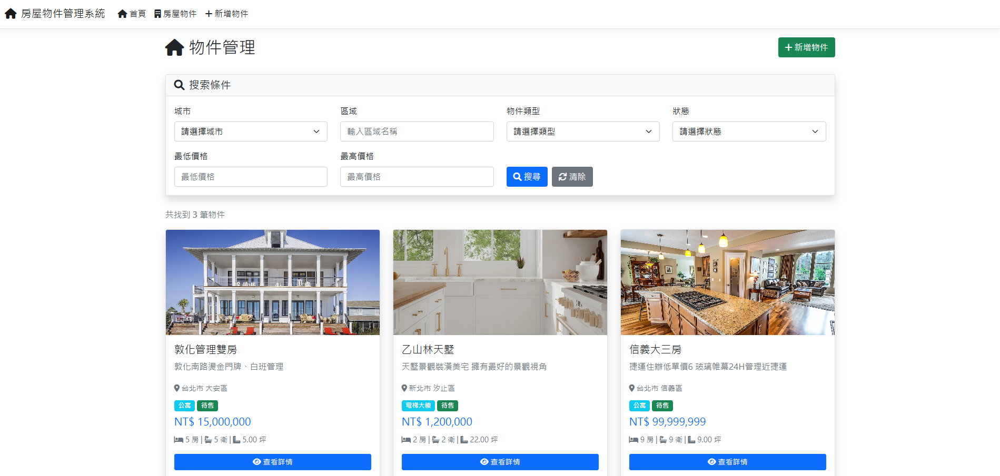
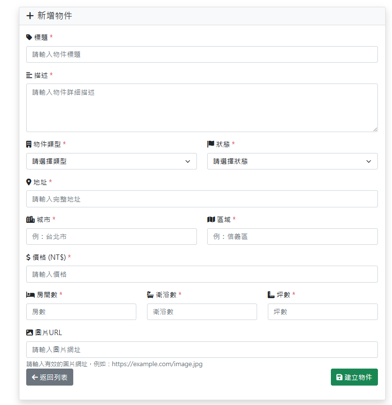
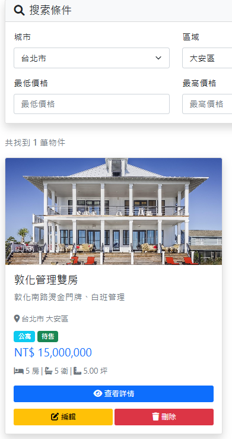

# 房屋物件管理系統

一個基於 ASP.NET Core MVC、Dapper 與 SQL Server 的房屋物件管理系統，支援物件新增、查詢、編輯、刪除與多條件搜尋。

---

## 技術規格
- ASP.NET Core 8.0 MVC (C#)
- Dapper ORM
- SQL Server (Docker)
- Bootstrap 5
- xUnit + Moq

---

## 主要功能
- 房屋物件 CRUD
- 多條件搜尋/篩選（城市、區域、類型、狀態、價格）
- 圖片 URL 支援
- Modal 刪除確認

---

## 系統畫面




---

## 快速開始
1. 啟動 Docker 資料庫與 Web：
  ```bash
  docker-compose up -d --build
  ```
2. 初始化資料庫（如需）：
  ```bash
  docker cp CreatePropertyDb.sql property_management_db:/var/opt/mssql/
  docker exec property_management_db /opt/mssql-tools18/bin/sqlcmd -S localhost -U sa -P "Property123!" -C -i /var/opt/mssql/CreatePropertyDb.sql
  ```
3. 啟動網站：
  ```bash
  dotnet run --project PropertyManagementSystem.Web
  ```
4. 瀏覽 http://localhost:5213

---

## 專案結構
```
PropertyManagementSystem.Core/   # 業務邏輯/模型
PropertyManagementSystem.Data/   # Dapper 資料存取
PropertyManagementSystem.Web/    # MVC Web 專案
PropertyManagementSystem.Tests/  # 單元測試
docker-compose.yml               # Docker 設定
CreatePropertyDb.sql             # 資料表建置 SQL
```

---

## 授權
MIT License
